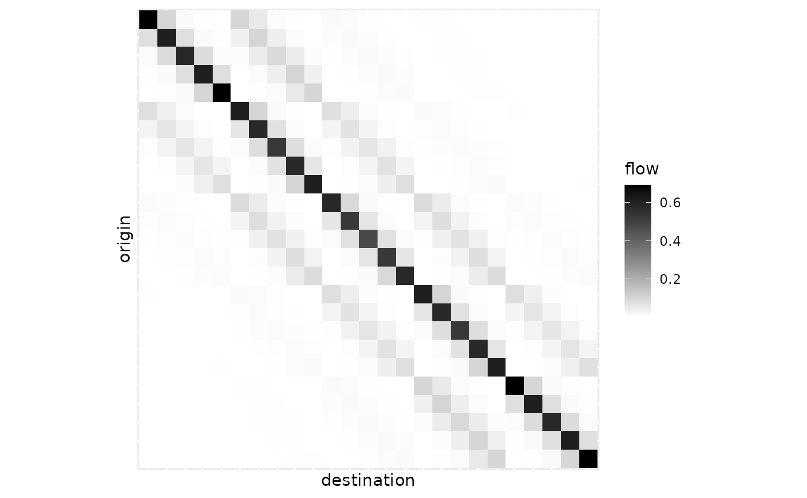
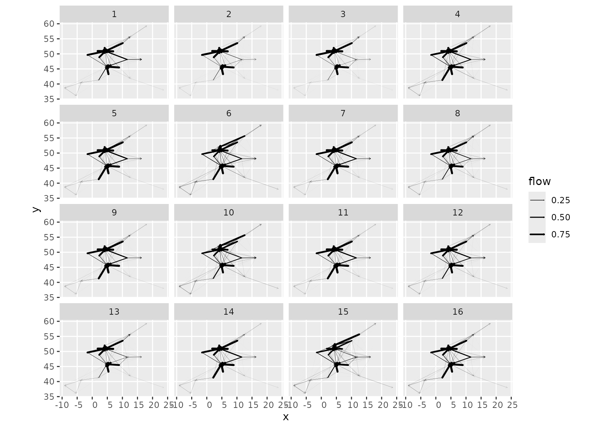

# Systematic exploration of the BLV solution space

``` r
library(blvim)
## we use ggplot2 for graphical representations
library(ggplot2)
```

One of the main objectives of the `blvim` package is to ease the
systematic exploration of the BLV model’s solution space when \\\alpha\\
and \\\beta\\ vary. This is supported by a collection of `grid_*`
functions.

## Locations and setup

We shall work with a regular grid of locations, in a symmetric
(non-bipartite) case.

``` r
locations <- expand.grid(x = 1:5, y = 1:5)
locations$name <- LETTERS[1:25]
ggplot(locations, aes(x, y, label = name)) +
  geom_text() +
  coord_fixed()
```


We use the Euclidean distance between the points as the interaction
costs.

``` r
costs <- as.matrix(dist(locations[c("x", "y")]))
```

And finally, we consider unitary productions and initial
attractivenesses.

``` r
location_prod <- rep(1, nrow(locations))
location_att <- rep(1, nrow(locations))
```

## Computing a collection of models

The main function for systematic exploration is
[`grid_blvim()`](https://fabrice-rossi.github.io/blvim/reference/grid_blvim.md),
which computes a collection of spatial interaction models (the BLV
models obtained by
[`blvim()`](https://fabrice-rossi.github.io/blvim/reference/blvim.md))
for all pairwise combinations of \\\alpha\\ and \\\beta\\ provided.

For the \\\alpha\\ parameter, we generally recommend focussing on values
strictly larger than 1 (setting \\\alpha=1\\ significantly slows down
the convergence of the fixed-point algorithm used in the BLV model). For
\\\beta\\, we aim to cover local models (with a large \\\beta\\) and
long-range ones (with a small \\\beta\\). Here, distances between
positions range from 1 to approximately 7, so a typical range for
\\\frac{1}{\beta}\\ could be \\\[0.5 ; 4\]\\.

The collection of models is computed by
[`grid_blvim()`](https://fabrice-rossi.github.io/blvim/reference/grid_blvim.md)
as follows. Note that while we could specify the location data as
parameters of the call, it is generally simpler to do so on the
resulting
[`sim_list()`](https://fabrice-rossi.github.io/blvim/reference/sim_list.md).

``` r
models <- grid_blvim(costs,
  location_prod,
  alphas = seq(1.05, 2, length.out = 25),
  betas = 1 / seq(0.5, 4, length.out = 25),
  location_att,
  bipartite = FALSE,
  epsilon = 0.1,
  iter_max = 5000,
  conv_check = 10
)
```

We specify now the location data.

``` r
destination_names(models) <- locations$name
destination_positions(models) <- as.matrix(locations[c("x", "y")])
```

An important point to note is that the
[`sim_list()`](https://fabrice-rossi.github.io/blvim/reference/sim_list.md)
returned by
[`grid_blvim()`](https://fabrice-rossi.github.io/blvim/reference/grid_blvim.md)
is *homogeneous*: it uses the same cost matrix and the same location
data. This is enforced in the package because most of the exploration
methods proposed would not make sense for a heterogeneous collection of
spatial interaction models.

## Exploring the results

### Single model extraction

The
[`sim_list()`](https://fabrice-rossi.github.io/blvim/reference/sim_list.md)
object behaves like a read-only list. We can therefore extract any of
the models, for instance to display the corresponding flows, as
demonstrated below for the first model, using both the standard matrix
display and the position-based one.

``` r
autoplot(models[[1]]) +
  scale_fill_gradient(low = "white", high = "black") +
  coord_fixed()
```



``` r
autoplot(models[[10]],
  flows = "full", with_positions = TRUE,
  arrow = arrow(length = unit(0.01, "npc"))
) +
  coord_fixed() +
  scale_linewidth_continuous(range = c(0, 1))
```


### Variability plot

The `sim_list` object has a
[`ggplot2::autoplot()`](https://ggplot2.tidyverse.org/reference/autoplot.html)
function that provides a variability plot. The aim is to display
statistics of the flows over the collection of spatial interaction
models in the list. The default representation focuses on individual
flows as shown below.

``` r
autoplot(models, with_names = TRUE) +
  theme_light()
```


For instance, the M column shows the flows received from all locations
by location M (the centre point of the locations). The thick squares
correspond to the median of the flow received by M over all the models.
The figure shows in particular that many of the locations do not receive
incoming flow in any model.

The position-based figure shows only the destination flows, using
circles to display statistics of those flows.

``` r
autoplot(models, flows = "destination", with_positions = TRUE) +
  scale_size_continuous(range = c(0, 7)) +
  coord_fixed()
```


The figure confirms that the external locations receive no flow. The
median flow received by M, the central location, is significantly larger
than other flows. The tiny internal circle for this location shows the
0.05 quartile: this indicates that for a few models in the list, the
central location does not receive any flow. This is illustrated for the
first model of the list in the figure above.

### Statistics-oriented display

In addition to the variability of the flows, we can display a numerical
value for each spatial interaction model on a single plot. To facilitate
this, the collection of models first has to be integrated into a data
frame-like model. This is done with the
[`sim_df()`](https://fabrice-rossi.github.io/blvim/reference/sim_df.md)
function.

``` r
models_df <- sim_df(models)
```

The result is a data frame with a special `sim` column that contains the
original
[`sim_list()`](https://fabrice-rossi.github.io/blvim/reference/sim_list.md)
object as well as the parameters used to build the model (\\\alpha\\ and
\\\beta\\), diagnostics on the
[`blvim()`](https://fabrice-rossi.github.io/blvim/reference/blvim.md)
runs, and the Shannon
[`diversity()`](https://fabrice-rossi.github.io/blvim/reference/diversity.md)
of the models.

``` r
knitr::kable(head(models_df))
```

|    alpha | beta | diversity | iterations | converged | sim        |
|---------:|-----:|----------:|-----------:|:----------|:-----------|
| 1.050000 |    2 | 24.885897 |        640 | TRUE      | c(0.6908…. |
| 1.089583 |    2 | 24.844876 |        910 | TRUE      | c(0.6890…. |
| 1.129167 |    2 | 24.758832 |       2040 | TRUE      | c(0.6875…. |
| 1.168750 |    2 | 23.174828 |       5001 | FALSE     | c(0.6796…. |
| 1.208333 |    2 |  8.776566 |       2640 | TRUE      | c(0.7026…. |
| 1.247917 |    2 |  5.770688 |       1160 | TRUE      | c(0.5686…. |

The
[`sim_df()`](https://fabrice-rossi.github.io/blvim/reference/sim_df.md)
object has a
[`ggplot2::autoplot()`](https://ggplot2.tidyverse.org/reference/autoplot.html)
function which shows by default the diversities of the models.

``` r
autoplot(models_df) +
  scale_fill_viridis_c()
```


The figure shows, for each combination of parameters \\\alpha\\ and
\\\beta\\, a coloured rectangle that represents the chosen numerical
value for the corresponding model. One can display any column of the
`sim_df` object, for instance the convergence status.

``` r
autoplot(models_df, converged)
```


The
[`autoplot.sim_df()`](https://fabrice-rossi.github.io/blvim/reference/autoplot.sim_df.md)
function uses tidy evaluation, which enables the user to compute
interesting values on the fly, as in the following figure that displays
the number of terminals per model, according to the Nystuen and Dacey
definition.

``` r
autoplot(models_df, diversity(sim, "ND")) +
  scale_fill_viridis_c()
```


## Organising the results

### Clustering the models

The set of all models, while structured, can be difficult to understand
completely using only the tools presented above. To take the analysis
further, it may be useful to cluster the models and to display
representative elements of the clusters. To ease this task, we support
distance-based approaches (such as hierarchical clustering and
partitioning around medoids) via
[`sim_distance()`](https://fabrice-rossi.github.io/blvim/reference/sim_distance.md).
For instance, the following call computes all pairwise Euclidean
distances between the destination flows of the models in a
[`sim_list()`](https://fabrice-rossi.github.io/blvim/reference/sim_list.md).

``` r
models_dist <- sim_distance(models, "destination")
```

This can then be used as the input of a hierarchical clustering.

``` r
models_hc <- hclust(models_dist, method = "ward.D2")
```

For the studied example, the structure of the model set is highly
specific, as a very large subset of them is the same model, with all the
flow sent to the central location. This is partly visible in the
dendrogram of the clustering, with the large cluster on the left.

``` r
plot(models_hc, hang = -1, labels = FALSE)
```


Since we use clustering primarily to explore the result set, we can set
the number of clusters to an arbitrary value: we are not looking for a
clustering structure but rather we want to summarise the model set. A
small number of clusters will generally provide a summary that is too
crude, while a large number will be difficult to analyse. Here, we
arbitrarily chose 16 clusters.

The best way to integrate the clustering result for further analysis is
to add a new column to the
[`sim_df()`](https://fabrice-rossi.github.io/blvim/reference/sim_df.md)
giving the class membership, as follows for instance:

``` r
models_df$cluster <- as.factor(cutree(models_hc, k = 16))
```

This can be immediately used in the standard
[`sim_df()`](https://fabrice-rossi.github.io/blvim/reference/sim_df.md)
visualisation.

``` r
autoplot(models_df, cluster)
```


### Showing cluster variability

Two functions are available in `blvim` to leverage any partition of a
collection of spatial interaction models. Both of them use
[`ggplot2::facet_wrap()`](https://ggplot2.tidyverse.org/reference/facet_wrap.html)
to combine standard individual visualisations into an organised one. The
first function,
[`grid_var_autoplot()`](https://fabrice-rossi.github.io/blvim/reference/grid_var_autoplot.md),
shows a variability representation for each of the groups identified by
a partitioning variable in a
[`sim_df()`](https://fabrice-rossi.github.io/blvim/reference/sim_df.md)
object.

Using the clustering obtained above, we simply execute:

``` r
grid_var_autoplot(models_df, cluster)
```


This gives a flow variation panel for each of the 16 clusters. The
redundancy in the display suggests that we requested too many clusters,
but apart from that, the representation outlines a collection of very
distinct model classes:

- a model of central dominance (clusters 13 to 16)
- models with a dominant diagonal (mostly self-interaction, in clusters
  1 to 3)
- models where the central location does not receive any flow (clusters
  4 and 9)
- more complex patterns in clusters 5 to 8, and 10 to 12

We can gain further insight into the different behaviours using the
location positions, provided we focus on the destination flows.

``` r
grid_var_autoplot(models_df, cluster,
  flows = "destination",
  with_positions = TRUE
) +
  scale_size_continuous(range = c(0, 4)) +
  coord_fixed()
```


The fact that we see only one circle at most per position illustrates
the quality of the clusters (this was also the case in the previous
visualisation, but less clearly). Indeed, this means that the
destination flows are almost constant in each cluster of models.
Moreover, this representation, while blind to the actual pairwise flows,
shows the structure of the clusters. In particular, it emphasises subtle
differences between cluster 13 and clusters 14 to 16 (and similarly for
e.g. clusters 10 and 11).

### Finding representative models

In addition to the variability plots, one may want to extract some
representative examples from each cluster. The
[`median.sim_list()`](https://fabrice-rossi.github.io/blvim/reference/median.sim_list.md)
function provides a solution based on the concept of generalised median
(also called *medoid*): the function returns, from a collection of
spatial interaction models in a
[`sim_list()`](https://fabrice-rossi.github.io/blvim/reference/sim_list.md),
the one that is on average the closest to all the other models. The
distance used is one of the distances provided by `grid_distance()`. It
is recommended to use the same distance for clustering, but this is not
enforced by the function (as it applies to any
[`sim_list()`](https://fabrice-rossi.github.io/blvim/reference/sim_list.md)).
In practice, we use [`tapply()`](https://rdrr.io/r/base/tapply.html) to
compute a list of medoids, and then build a
[`sim_list()`](https://fabrice-rossi.github.io/blvim/reference/sim_list.md)
and a
[`sim_df()`](https://fabrice-rossi.github.io/blvim/reference/sim_df.md).

``` r
models_centre <- sim_list(tapply(models, models_df$cluster,
  median,
  flows = "destination"
))
models_centre_df <- sim_df(models_centre)
```

This small collection of models can then be displayed exhaustively,
using
[`grid_autoplot()`](https://fabrice-rossi.github.io/blvim/reference/grid_autoplot.md).
This function uses
[`ggplot2::facet_wrap()`](https://ggplot2.tidyverse.org/reference/facet_wrap.html)
to show a standard spatial interaction model graphical representation
(the ones provided by
[`autoplot.sim()`](https://fabrice-rossi.github.io/blvim/reference/autoplot.sim.md))
for each of the models in a `sim_df`. For instance, one can get the
flows of all medoids as follows.

``` r
grid_autoplot(models_centre_df) +
  scale_fill_gradient(low = "white", high = "black") +
  coord_fixed()
```


The function supports all the individual representations, for instance
flows with positions.

``` r
grid_autoplot(models_centre_df,
  flows = "full", with_positions = TRUE,
  arrow = arrow(length = unit(0.015, "npc"))
) +
  scale_linewidth_continuous(range = c(0, 0.5)) +
  coord_fixed()
```


Destination flows with positions are also supported.

``` r
grid_autoplot(models_centre_df, flows = "destination", with_positions = TRUE) +
  scale_size_continuous(range = c(0, 6)) +
  coord_fixed()
```


In this example, the structure of the result collection is quite simple
and was already captured to a large extent by the variability plots. In
more complex situations, the series of graphics are complementary and
give a better insight into the solution space.

## Real-world examples

### European cities

Let us analyse the `eurodist` dataset, which consists of road distances
between 21 cities in Europe. We use approximate coordinates of those
cities obtained from [OpenStreetMap](https://www.openstreetmap.org/).

``` r
data("eurodist")
eurodist_names <- labels(eurodist)
eurodist_names[match("Lyons", eurodist_names)] <- "Lyon"
eurodist_names[match("Marseilles", eurodist_names)] <- "Marseille"
eurodist_mat <- as.matrix(eurodist)
colnames(eurodist_mat) <- eurodist_names
rownames(eurodist_mat) <- eurodist_names
eurodist_coord <- data.frame(
  longitude = c(
    23.7337556, 2.14541, 4.3386684, 1.8110332, -1.5839619,
    6.94851185, 12.56571, 6.12186775, -5.3482947, 10.1185387,
    4.1148457, -9.1655069, 4.83042935, -3.7034351, 5.3805535,
    8.90758575, 11.6032322, 2.3222823, 12.5451136, 18.0710935,
    16.37833545
  ),
  latitude = c(
    37.9726176, 41.31120535, 50.89415265, 50.9338734, 49.6456093,
    50.84446155, 55.67613, 46.20823855, 36.1113418, 53.57845325,
    51.96912755, 38.7076287, 45.7591956, 40.47785335, 43.28032785,
    45.48039615, 48.1235428, 48.8787706, 41.8983351, 59.3251172,
    48.1653537
  ),
  name = eurodist_names
)
```

This yields the following map.

``` r
ggplot(eurodist_coord, aes(longitude, latitude, label = name)) +
  geom_point() +
  ggrepel::geom_label_repel() +
  coord_sf(crs = "epsg:4326")
```


#### Models

We fit a collection of SIMs with a wide range of values for both
parameters.

``` r
euro_models <- grid_blvim(eurodist_mat,
  rep(1, 21),
  alphas = seq(1.05, 1.75, length.out = 30),
  betas = 1 / seq(50, 750, length.out = 30),
  rep(1, 21),
  bipartite = FALSE,
  epsilon = 0.05,
  iter_max = 40000,
  conv_check = 50
)
```

``` r
destination_positions(euro_models) <- as.matrix(eurodist_coord[1:2])
euro_models_df <- sim_df(euro_models)
```

Most parameter pairs lead to relatively fast convergence, with the
exception of a few values.

``` r
autoplot(euro_models_df, iterations) +
  scale_fill_viridis_c()
```


The full range of diversity possible with 21 cities is covered in the
parameter space, which indicates that extending the parameter range will
unlikely uncover SIMs that differ significantly from those obtained with
the chosen range.

``` r
autoplot(euro_models_df, diversity) +
  scale_fill_viridis_c()
```


#### Variability plot

The flow variability plot outlines a few cities as potentially dominant.
Lyon is the strongest. This is explained by its central position on the
map. We expect to find it as the single dominant city in many
configurations. Hook of Holland and Brussels also appear, but to a
lesser extent. Gibraltar is also potentially active in some
configurations. Athens and Stockholm are frequently the sole recipients
of their own flow, probably owing to their isolated positions.

``` r
autoplot(euro_models, with_names = TRUE) +
  theme(axis.text.x = element_text(angle = 90, vjust = 0.5, hjust = 1))
```


Destination flows tell the same story. Notably, most of the cities have
a null median incoming flow, apart from Athens, Gibraltar, Lyon and
Stockholm. In addition, most of the cities have a 0.95 quantile of 1,
which corresponds to local configurations, that is situations when
\\\beta\\ is large enough to prevent any external flows. Only Brussels
and Hook of Holland stand out (in addition to the four cities mentioned
above).

``` r
autoplot(euro_models, flows = "destination", with_names = TRUE) +
  coord_flip()
```


``` r
autoplot(euro_models,
  flows = "destination", with_positions = TRUE,
  with_names = TRUE
) +
  scale_size_continuous(range = c(0, 6)) +
  coord_sf(crs = "epsg:4326")
```


#### Clustering

We apply the same clustering strategy as with the artificial data: 16
clusters obtained with hierarchical clustering using the Ward criterion.

``` r
euro_models_dist <- sim_distance(euro_models, "destination")
euro_models_hc <- hclust(euro_models_dist, method = "ward.D2")
```

The dendrogram clearly shows three main clusters, but as explained
above, the role of clustering is to facilitate exploration of the result
spaces rather than to identify distinct clusters.

``` r
plot(euro_models_hc, hang = -1, labels = FALSE)
```


The clusters are well organised on the parameter set.

``` r
euro_models_df$cluster <- as.factor(cutree(euro_models_hc, k = 16))
autoplot(euro_models_df, cluster) +
  theme(legend.position = "bottom") +
  guides(fill = guide_legend(nrow = 2))
```


The variability plot shows mostly isolated circles with no inner or
outer ring. This means that the clusters are relatively homogeneous in
terms of destination flows, and thus median flows will give a good idea
of typical behaviours.

``` r
grid_var_autoplot(euro_models_df, cluster,
  flows = "destination",
  with_positions = TRUE
) +
  scale_size_continuous(range = c(0, 6)) +
  coord_sf(crs = "epsg:4326")
```


Those behaviours are visible both at the destination flow level (above)
and at the flow level (below):

- Clusters 1 to 3 correspond to situations where most of the flows are
  local (hence the importance of the diagonal flow), with a progressive
  shift towards sending flow to Lyon. Brussels is also important in
  clusters 2 and 3.
- Clusters 4, 6 and 7 maintain a relatively strong diagonal (self) flow
  with more flows sent to Lyon and a transition between Brussels and
  Hook of Holland
- Clusters 5, 8 and 9 are intermediate situations where some cities play
  the role of local attractors, e.g., Rome and Vienna, but the
  concentration on external cities and Lyon and Brussels (5 and 8) or
  Hook of Holland (9) is progressing.
- Clusters 10 to 12 are situations where both Lyon and Hook of Holland
  share incoming flows, with more (10) or fewer (12) flows reaching
  external cities such as Stockholm, Athens and the trio Gibraltar,
  Lisbon and Madrid.
- Clusters 13 to 15 show Lyon as the dominating city, while in cluster
  16, Lyon shares its incoming flow with Hook of Holland.

``` r
grid_var_autoplot(euro_models_df, cluster)
```


#### Medoids

Finally, we look at medoids.

``` r
euro_models_centre <- sim_list(tapply(euro_models, euro_models_df$cluster,
  median,
  flows = "destination"
))
euro_models_centre_df <- sim_df(euro_models_centre)
```

The medoids confirm the analysis given above.

``` r
grid_autoplot(euro_models_centre_df) +
  scale_fill_gradient(low = "white", high = "black") +
  coord_fixed()
```


``` r
grid_autoplot(euro_models_centre_df,
  flows = "destination",
  with_positions = TRUE
) +
  scale_size_continuous(range = c(0, 6)) +
  coord_sf(crs = "epsg:4326")
```


``` r
grid_autoplot(euro_models_centre_df,
  with_positions = TRUE, arrow = arrow(length = unit(0.015, "npc"))
) +
  scale_linewidth_continuous(range = c(0, 0.75)) +
  coord_sf(crs = "epsg:4326")
```


To further the analysis, one can focus on a particular medoid, for
instance cluster 1:

``` r
autoplot(euro_models_centre[[1]],
  flows = "full", with_positions = TRUE,
  arrow = arrow(length = unit(0.015, "npc"))
) +
  scale_linewidth_continuous(range = c(0, 2)) +
  coord_sf(crs = "epsg:4326")
```


Or cluster 5:

``` r
autoplot(euro_models_centre[[5]],
  flows = "full", with_positions = TRUE,
  arrow = arrow(length = unit(0.015, "npc"))
) +
  scale_linewidth_continuous(range = c(0, 2)) +
  coord_sf(crs = "epsg:4326")
```


Finally, one can randomly select a subset of the models in a cluster and
use
[`grid_autoplot()`](https://fabrice-rossi.github.io/blvim/reference/grid_autoplot.md)
to display these models all at once. This offers a way to visually
assess the variability within that cluster. For instance, in the figure
below for cluster 4, most of the models are very similar, but some
differences exist, such as the flows to Hamburg and Copenhagen, whose
level varies across the configurations (compare 6 to 7, for instance).

``` r
set.seed(0)
euro_models_idx <- sample(which(euro_models_df$cluster == 4), 16)
euro_models_cl4_sample <- euro_models[euro_models_idx]
euro_models_cl4_sample_df <- sim_df(euro_models_cl4_sample)
grid_autoplot(euro_models_cl4_sample_df, with_positions = TRUE) +
  scale_linewidth_continuous(range = c(0, 1)) +
  coord_sf(crs = "epsg:4326")
```



### French cities

We use the `french_cities` data set to illustrate the bipartite case
when origin and destination locations differ. Here we consider flows
from the largest French cities (in terms of population) to the smallest
ones. As shown below, the distribution of the smallest cities is not all
uniform as they cluster around large ones, especially around Paris.

``` r
big_cities <- french_cities[1:20, ]
small_cities <- french_cities[102:121, ]
fr_cities <- rbind(big_cities, small_cities)
fr_cities$type <- c(rep("origin", 20), rep("destination", 20))
ggplot(
  fr_cities,
  aes(x = th_longitude, y = th_latitude, color = type)
) +
  geom_point() +
  coord_sf(crs = "epsg:4326")
```


#### Production effects

``` r
frcosts <- french_cities_distances[1:20, 102:121] / 1000
fr_prod <- french_cities$population[1:20]
fr_attr <- rep(1, 20)
origin_data <- list(
  names = french_cities$name[1:20],
  positions = as.matrix(french_cities[
    1:20,
    c("th_longitude", "th_latitude")
  ])
)
destination_data <- list(
  names = french_cities$name[102:121],
  positions = as.matrix(french_cities[
    102:121,
    c("th_longitude", "th_latitude")
  ])
)
```

As we have information about the cities, we may use it to drive the
model. In particular, population sizes are natural production
constraints. As France is somewhat centralised, Paris is by far the
largest city. The combined population of Marseille, Lyon and Toulouse is
smaller than the Paris population. In addition, there is a sharp drop in
population size between Toulouse, with roughly 500,000 inhabitants, and
Nice with 350,000 inhabitants.

Consequently, using population sizes directly as a production constraint
may lead to some extreme models. To investigate this, we use the global
analysis permitted by
[`grid_blvim()`](https://fabrice-rossi.github.io/blvim/reference/grid_blvim.md)
and associated functions.

We use first the logarithm of the population as the production
constraint.

``` r
fr_models <- grid_blvim(frcosts,
  log(fr_prod),
  alphas = seq(1.05, 1.75, length.out = 30),
  betas = 1 / seq(5, 200, length.out = 30),
  fr_attr,
  epsilon = 0.05,
  iter_max = 40000,
  conv_check = 50,
  origin_data = origin_data,
  destination_data = destination_data
)
fr_models_df <- sim_df(fr_models)
```

The diversities of the models are relatively small as shown below,
despite relatively short cut-off distances (the smallest value of
\\\frac{1}{\beta}\\ is 5 km). The degenerate patterns with bipartite
models are different from the diagonal ones obtained with non-bipartite
models. If we decrease the cut-off distance too much (i.e. if we use
large values of \\\beta\\), each origin location will send all of its
production to its nearest neighbours. Here this leads to a maximum
diversity of 8.44 while in a non-bipartite case, we would expect a
maximum around 20 (for 20 cities).

``` r
autoplot(fr_models_df) +
  labs(title = "Log population")
```


With the `log` transform, small cities around Paris do not receive much
flow, apart for Saint-Ouen-Sur-Seine, Fontenay-sous-Bois and
Sartrouville. Notice the absence of diagonal patterns.

``` r
autoplot(fr_models, with_names = TRUE) +
  theme_light() +
  theme(axis.text.x = element_text(angle = 90, vjust = 0.5, hjust = 1)) +
  labs(title = "Log population")
```


``` r
autoplot(fr_models,
  flows = "destination", with_names = TRUE,
  with_positions = TRUE
) +
  coord_sf(crs = "epsg:4326") +
  labs(title = "Log population")
```


We then use the population size directly.

``` r
fr_models_direct <- grid_blvim(frcosts,
  fr_prod,
  alphas = seq(1.05, 1.75, length.out = 30),
  betas = 1 / seq(5, 200, length.out = 30),
  fr_attr,
  epsilon = 0.05,
  iter_max = 40000,
  conv_check = 50,
  origin_data = origin_data,
  destination_data = destination_data
)
fr_models_direct_df <- sim_df(fr_models_direct)
```

We observe a trend of smaller diversities with a maximum of 6.97. The
dominance of Paris as a producer tends to limit the emergence of
multiple receivers and to concentrate the flows on a smaller number of
cities.

``` r
autoplot(fr_models_direct_df) +
  labs(title = "Population")
```


In this case the flow from Paris becomes dominant and more small cities
around Paris receive flow, with a limited effect on other cities, as the
flows are mostly local. This is revealed in the graphical representation
thanks to the origin based normalisation.

``` r
autoplot(fr_models_direct, with_names = TRUE, normalisation = "origin") +
  theme_light() +
  theme(axis.text.x = element_text(angle = 90, vjust = 0.5, hjust = 1)) +
  labs(title = "Population")
```

 The geographical
representation shows the emergence of these smaller cities.

``` r
options("ggrepel.max.overlaps" = 20)
autoplot(fr_models_direct,
  flows = "destination", with_names = TRUE,
  with_positions = TRUE
) +
  coord_sf(crs = "epsg:4326") +
  labs(title = "Population")
```

 By default, the flows
are not normalised in the variability plot, and the global normalisation
emphasises Paris’ dominance and its preferred destination,
Saint-Ouen-Sur-Seine, more strongly. This representation shows similar
patterns for Marseille with Arles and to a lesser extent for Lyon with
Vaulx-en-Velin, and Toulouse with Arles and Albi.

``` r
autoplot(fr_models_direct, with_names = TRUE, normalisation = "full") +
  theme_light() +
  theme(axis.text.x = element_text(angle = 90, vjust = 0.5, hjust = 1)) +
  labs(title = "Population global normalisation")
```


#### Clustering

To investigate the differences between production constraints in more
detail, we can cluster the results. As shown by the dendrograms and the
cluster maps, the results are significantly influenced by the production
constraints.

``` r
fr_models_dist <- sim_distance(fr_models, "destination")
fr_models_hc <- hclust(fr_models_dist, method = "ward.D2")
```

``` r
plot(fr_models_hc, hang = -1, labels = FALSE)
```


``` r
fr_models_df$cluster <- as.factor(cutree(fr_models_hc, k = 16))
autoplot(fr_models_df, cluster) +
  theme(legend.position = "bottom") +
  guides(fill = guide_legend(nrow = 2)) +
  labs(title = "Log population")
```


``` r
fr_models_direct_dist <- sim_distance(fr_models_direct, "destination")
fr_models_direct_hc <- hclust(fr_models_direct_dist, method = "ward.D2")
```

``` r
plot(fr_models_direct_hc, hang = -1, labels = FALSE)
```


``` r
fr_models_direct_df$cluster <- as.factor(cutree(fr_models_direct_hc, k = 16))
autoplot(fr_models_direct_df, cluster) +
  theme(legend.position = "bottom") +
  guides(fill = guide_legend(nrow = 2)) +
  labs(title = "Population")
```

 The per-cluster
variability plots are very informative. They show very limited
variability within each cluster and display different configurations.
Contrast for instance cluster 13 for the log population model with
cluster 16 for the direct population model. With the log population
model, there are configurations with a single dominating site, cluster
13 (this aligns with the minimal value of the diversity which is 1). On
the contrary, the direct population model does not lead to such as
situation, we always have at least two important sites, as in cluster 16
(again, this aligns with the minimal value of the diversity, 1.95).

``` r
grid_var_autoplot(fr_models_df, cluster,
  flows = "destination",
  with_positions = TRUE
) +
  scale_size_continuous(range = c(0, 6)) +
  coord_sf(crs = "epsg:4326") +
  labs(title = "Log population")
```


``` r
grid_var_autoplot(fr_models_direct_df, cluster,
  flows = "destination",
  with_positions = TRUE
) +
  scale_size_continuous(range = c(0, 6)) +
  coord_sf(crs = "epsg:4326") +
  labs(title = "Population")
```

 One could prolong the
analysis by investigating individual clusters, for instance by
displaying the median models or a selection of diverse models.
